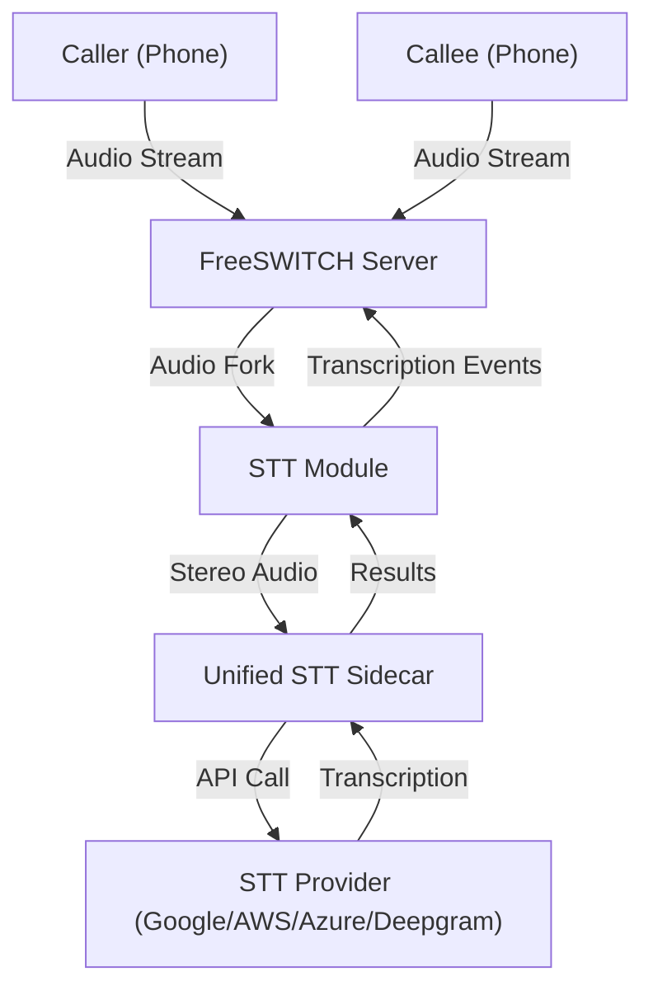

# FreeSWITCH + Unified Sidecar STT Architecture

This document describes the architecture of the FreeSWITCH + Unified Sidecar STT system.

## System Architecture

## Components

### Caller / Callee (Phone)
External participants in the call who provide audio input through their phone connections.

### FreeSWITCH Server
The core telephony server that handles call routing, audio processing, and event management.

### STT Module
FreeSWITCH module (e.g., mod_audio_fork) that:
- Captures audio from call channels
- Sends audio to the unified sidecar
- Receives transcription results
- Fires FreeSWITCH events with transcription data

### Unified STT Sidecar
A unified service that:
- Receives audio streams from FreeSWITCH modules
- Manages connections to multiple STT providers
- Handles audio format conversion
- Returns transcription results

### STT Provider
External speech-to-text services such as:
- Google Cloud Speech-to-Text
- AWS Transcribe
- Azure Speech Services
- Deepgram

## Audio Flow

1. **Call Initiation**: Caller and Callee connect to FreeSWITCH
2. **Audio Capture**: FreeSWITCH captures audio from both channels
3. **Audio Fork**: STT Module forks audio to the Unified Sidecar
4. **Transcription**: Unified Sidecar sends audio to STT Provider
5. **Results**: Transcription results flow back through the chain
6. **Events**: FreeSWITCH fires events with transcription data

## Key Features

- **Multi-Channel Support**: Handles stereo audio with separate caller/callee channels
- **Real-time Processing**: Streaming audio transcription
- **Multiple Provider Support**: Unified interface for multiple STT services
- **Event-Driven**: FreeSWITCH events for integration with other services
